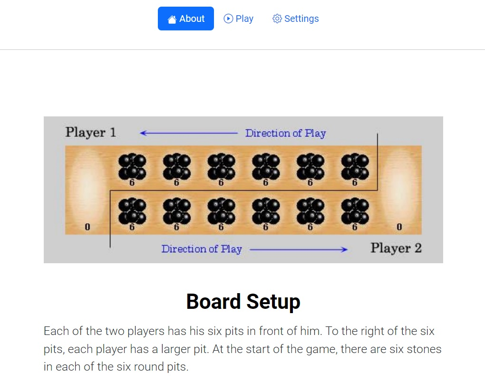
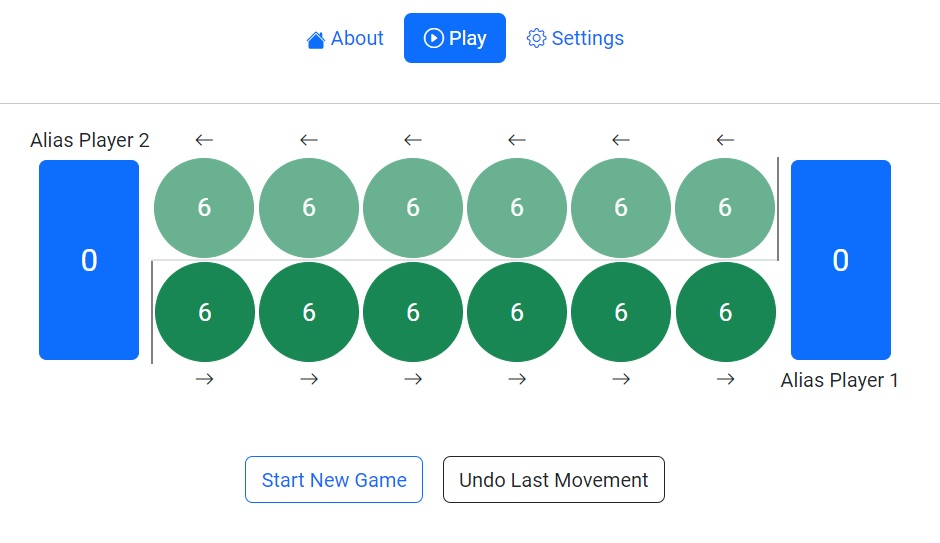
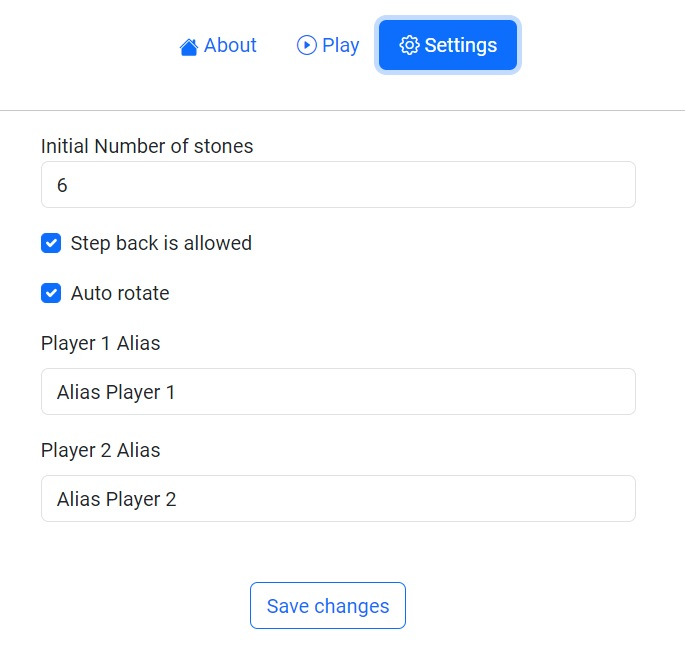

# MancalaUi

This project was generated with [Angular CLI](https://github.com/angular/angular-cli) version 16.2.3. It's the UI for a mancala game, with the [backend](https://github.com/erickturcios/mancala-backend) built with Java 21 (Spring boot)

## Development server

Run `ng serve` for a dev server. Navigate to `http://localhost:4200/`. The application will automatically reload if you change any of the source files.

## Screenshots

### Tab 1 - About

### Tab 2 - Board

### Tab 3 - Settings

